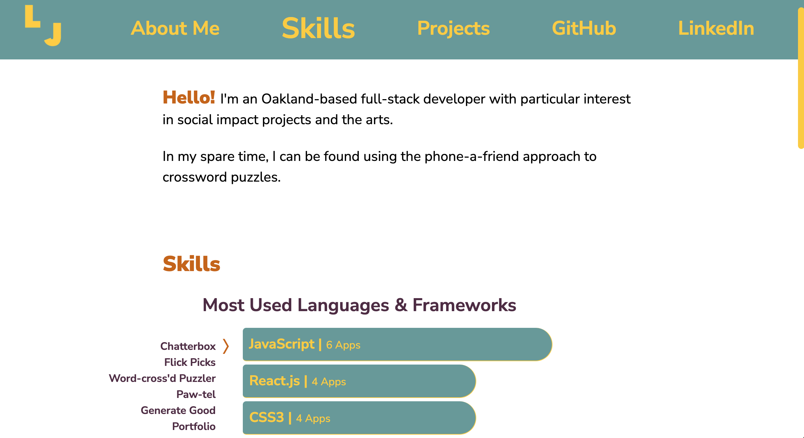

# Portfolio

## Overview

A mobile-responsive portfolio using Next.js, React, JavaScript, HTML and CSS.

View the live site here: https://www.louisajohnston.com/

## Code Snippets

Dynamically render graph:

```
 // Define object to hold tech data for state
      let techCount = {};

      projectData.forEach((project) => {
        const techArray = project.tech.split(", ");
        techArray.forEach((tech, i) => {
          if (tech.includes("and ")) {
            const newTech = tech.replace("and ", "");
            return (techArray[i] = newTech);
          } else {
            return (techArray[i] = tech);
          }
        }, techArray);

        techArray.forEach((tech) => {
          if (!techCount.hasOwnProperty(tech)) {
            techCount[tech] = 1;
          } else {
            techCount[tech]++;
          }
        });
      });

      // define array to hold tech data for graph
      let newArr = [];

      if (Object.keys(techCount).length !== 0) {
        Object.entries(techCount).forEach(([key, value]) =>
          newArr.push({ tech: `${key}`, count: value })
        );
      }

      const descArr = newArr.sort((a, b) => {
        return b.count - a.count;
      });

      setMostUsed(descArr.slice(0, 5));
```

Render projects from projects.json:

```
<div className="project-anchor" id="projects">
    <h2>Projects</h2>
    {projects.map((project, i) => {
        return (
            <Project
                key={i.toString()}
                i={i}
                name={project.name}
                tech={project.tech}
                details={project.details}
                github={project.github}
                deployed={project.deployed}
                images={project.images}
            />
        );
    })}
</div>
```

Conditionally render project details:

```
<div key={i.toString()}>
    <ul className="less-flush">
    {details.map((detail, i) => {
        return (
            <li key={i.toString()}>{detail}</li>
        )
    })}
    </ul>
    {gitLength ? (
        <a href={github[0]} target="_blank" className="repo less-flush offset block det-link">{name} Repo</a>
    ) : (
        <div>
            <a href={github[0]} target="_blank" className="repo less-flush offset block det-link">{name} Server Repo</a>
            <a href={github[1]} target="_blank" className="repo flush offset block det-link">{name} Client Repo</a>
        </div>
    )}
    {imagesLength ? (
        <SingleImage
            name={name}
            image={images[0]}
        />
    ) : (
        <Carousel
            name={name}
            images={images}
        />
    )}
</div>
```

Image carousel:

```
export default function Carousel({ images, name }) {
    const [currentImageIndex, setCurrentImageIndex] = useState(0);
    const LENGTH = images.length;

    const previousSlide = () => {
        const lastIndex = LENGTH - 1;
        const shouldResetIndex = currentImageIndex === 0;
        const index =  shouldResetIndex ? lastIndex : currentImageIndex - 1;
        setCurrentImageIndex(index);
      }

      const nextSlide = () => {
        const lastIndex = LENGTH - 1;
        const shouldResetIndex = currentImageIndex === lastIndex;
        const index =  shouldResetIndex ? 0 : currentImageIndex + 1;
        setCurrentImageIndex(index);
    }

    return (
        <div className="carousel">
            <Arrow
                direction="left"
                clickFunction={ previousSlide }
                glyph="&#9001;"
            />

            <ImageSlide image={ images[currentImageIndex] } name={name} />

            <Arrow
                direction="right"
                clickFunction={ nextSlide }
                glyph="&#9002;"
            />
        </div>
    );
};
```

## Images



