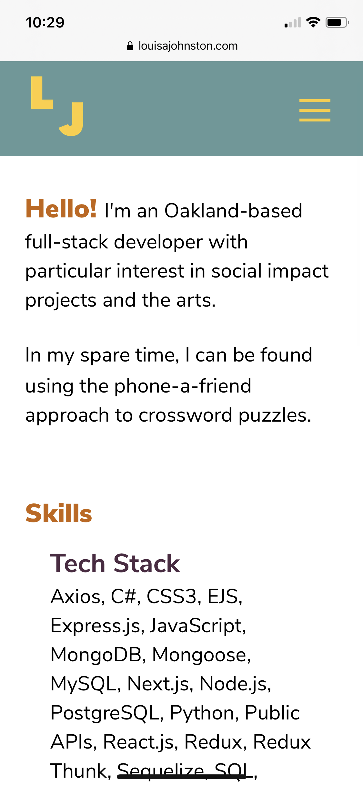

# Portfolio

## Overview
A mobile-responsive portfolio using Next.js, React, JavaScript, HTML and CSS.

View the live site here: https://www.louisajohnston.com/

## Images



## Code Snippets
Render projects from projects.json:
```
<div className="project-anchor" id="projects">
    <h2>Projects</h2>
    {projects.map((project, i) => {
    return (
        <Project
        key={i.toString()}
        i={i}
        name={project.name}
        tech={project.tech}
        details={project.details}
        github={project.github}
        deployed={project.deployed}
        images={project.images}
        />
    );
    })}
</div>
```


